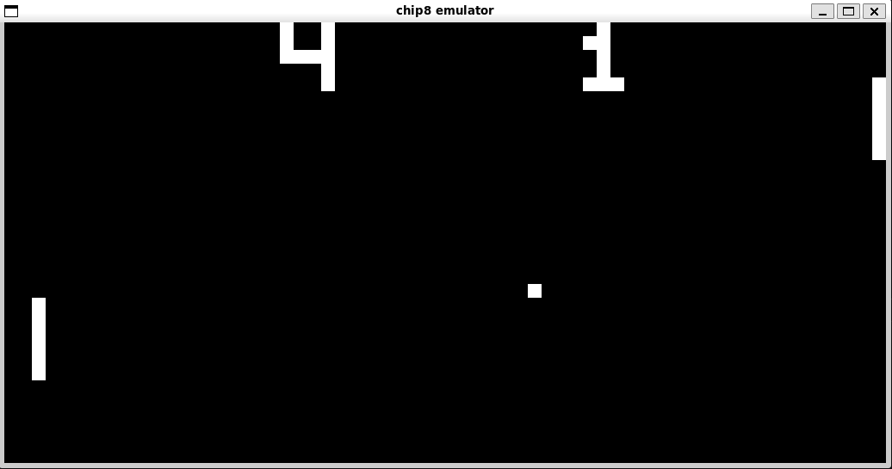

# CHIP-8 emulator in C

A high-performance, accurate CHIP-8 emulator written entirely from scratch in C. \
Built with a strict focus on low-level system architecture, raw bitwise operations.

 \
PONG

## Features
- **Optimized 64-bit Display Architecture:** The 64x32 monochrome screen is represented by a `uint64_t display[32]` array. This design choice leverages native 64-bit bitwise XOR operations for rendering efficiency, seamless sprite clipping, and fast collision detection (`V[0xF]`) without relying on traditional 2D boolean arrays.
- **Bitmask-driven Keypad:** Input state is managed by a single `uint16_t keypad` variable. All 16 hexadecimal keys are mapped directly to these 16 bits, allowing for highly efficient, $O(1)$ state updates and instruction decoding using simple bitwise shifts.
- **Audio Subsystem:** Generates dynamic raw square waves (440Hz beep) via `SDL_QueueAudio`.
- **Precise Timing:** Single-cycle emulation loop decoupled from 60Hz Delay and Sound timers, controlled via `SDL_GetTicks()` to ensure accurate game speeds.

## Controls

```
CHIP-8 Keypad            PC Keyboard
+-+-+-+-+                +-+-+-+-+
|1|2|3|C|                |1|2|3|4|
+-+-+-+-+                +-+-+-+-+
|4|5|6|D|                |Q|W|E|R|
+-+-+-+-+       =>       +-+-+-+-+
|7|8|9|E|                |A|S|D|F|
+-+-+-+-+                +-+-+-+-+
|A|0|B|F|                |Z|X|C|V|
+-+-+-+-+                +-+-+-+-+
```
- **ESC:** Quit the emulator
- **F1:** Reload the current ROM

## Dependencies

To build and run this emulator, you need:
- GCC (or any standard C compiler)
- SDL2 (`libsdl2-dev`)
- A Linux environment (Developed on WSL2 / Ubuntu)

## Building and Running

1. Install SDL2:
   ```
   sudo apt update
   sudo apt install libsdl2-dev
   ```

2. Make:
   ```
   make
   ```

3. Run a ROM:
   ```
   ./chip8 ./roms/<ROM>
   ```

## References

https://tobiasvl.github.io/blog/write-a-chip-8-emulator/ \
https://multigesture.net/articles/how-to-write-an-emulator-chip-8-interpreter/ \
https://en.wikipedia.org/wiki/CHIP-8 \
https://yukinarit.github.io/cowgod-chip8-tech-reference-ja/1_about_chip8.html 

